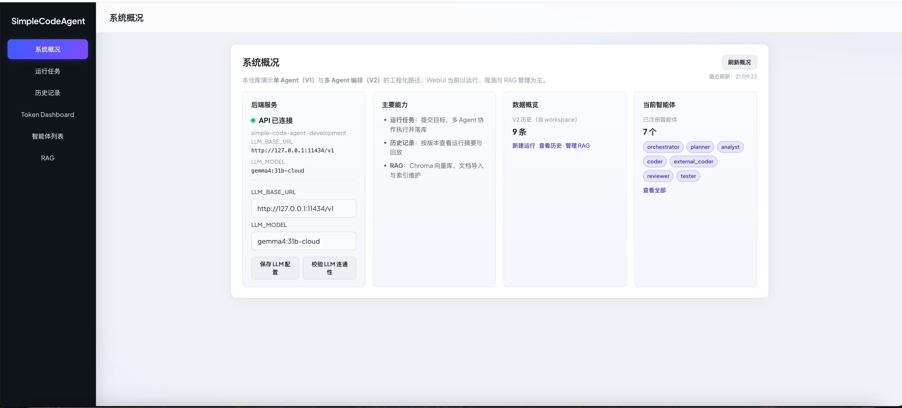
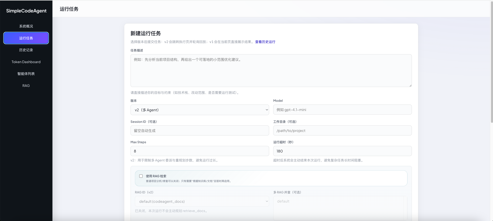
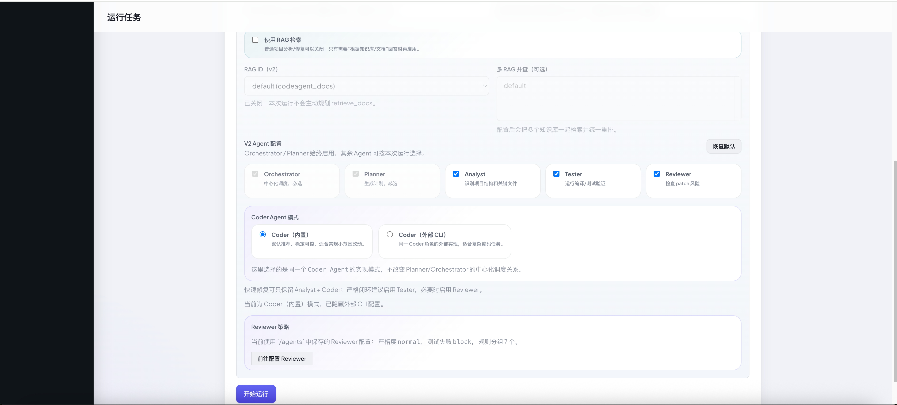
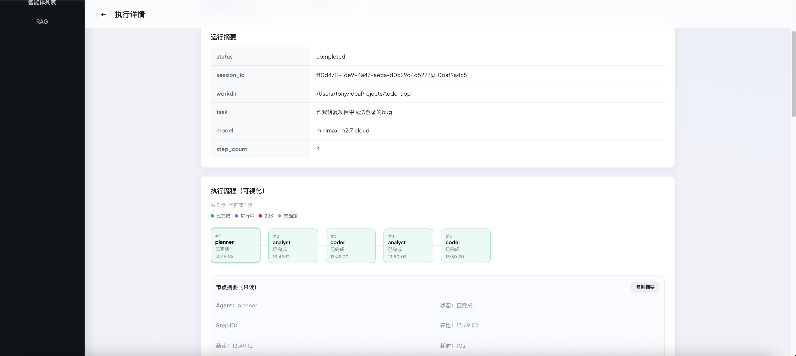
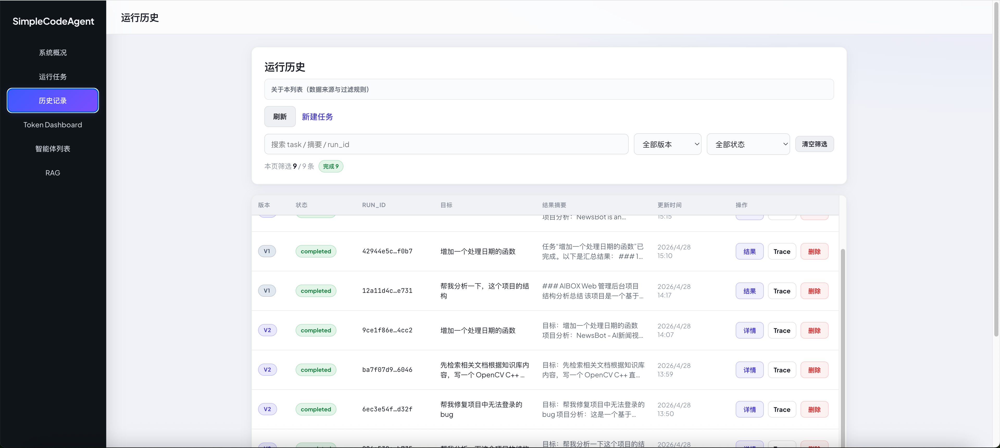
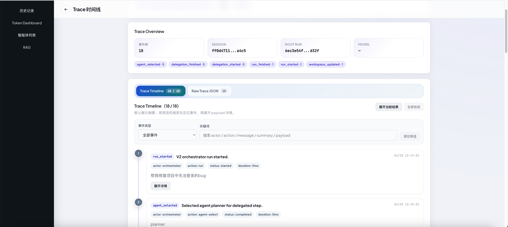

# SimpleCodeAgent

一个用于教学和演示的 **编程智能体工程化演进项目**。

这个仓库不是“大而全”的 Agent 框架，而是一套可运行、可观察、可逐步扩展的 Code Agent 样例工程。它重点展示：如何从一个轻量单 Agent Runtime，演进到一个中心化、多角色、可回放、可配置的多 Agent 编程系统。

你可以把它理解为两门课程的配套工程：

- `v1` 基础课：从零实现一个可运行的单 Agent CodeAgent。
- `v2` 高级课：在不破坏 v1 的前提下，演进出中心化多 Agent 编排、共享上下文、失败回流、External Coder 与 WebUI 可观测能力。

---

## 相关链接

- OpenVitamin：<https://github.com/fengzhizi715/OpenVitamin>
- 基础课程购买：<https://gttmx.xetlk.com/s/4aaPVM>
- 使用指南：[`docs/usage_guide.md`](docs/usage_guide.md)
- API 文档：[`docs/api_reference.md`](docs/api_reference.md)
- V2 状态：[`docs/v2_status.md`](docs/v2_status.md)

---

## 这个项目适合谁

- 想系统学习 Code Agent 内部实现的开发者
- 想理解 Tool Calling、Memory、RAG、Trace、Runtime Loop 的工程师
- 想从单 Agent 过渡到多 Agent 编排的工程师
- 想学习 Orchestrator / Planner / Specialist Agent 分工的人
- 想看一个教学友好、边界清晰、可运行的 Agent 工程样例，而不只是调用 LangChain / LangGraph 等框架的人

---

## WebUI 截图

### 1. Overview 页面



### 2. Run 页面





### 3. 执行详情页



### 4. History 页面



### 5. Trace 页面



---

## 当前版本能力

### V1：单 Agent 基础闭环

`app/v1` 是一个轻量、稳定、适合教学的单 Agent Runtime。它重点讲清楚一个编程智能体的基础闭环：

- LLM Provider 抽象
- Agent Runtime Loop
- Tool Contract / Registry / Router
- 文件读写、搜索、Shell 执行
- Session Memory
- 单库 RAG 检索
- Simple Planner
- Trace 与运行记录
- CLI / HTTP API 基础入口

V1 的定位是：简单、稳定、可教学，不承担复杂多 Agent 编排职责。

### V2：中心化多 Agent CodeAgent

`app/v2` 是当前重点演进版本，采用 **Centralized Multi-Agent Orchestration**：

- `Orchestrator`：中心化调度者，负责计划执行、委派、回流、终止与最终汇总。
- `Planner`：生成结构化 `Plan / PlanStep`，支持 disabled agent 调整、replan、step strategy explanation。
- `Analyst`：分析项目结构、关键文件、技术栈与上下文摘要。
- `Coder`：内置编码执行器，复用 v1 AgentLoop，适合教学“两层 loop”边界。
- `ExternalCoder`：外部编码执行器，可调用 Codex CLI / Cursor CLI 执行复杂编码任务。
- `Tester`：运行测试 / 构建命令，并输出结构化测试报告。
- `Reviewer`：规则库 + LLM review，支持运行级策略和测试失败联动。

V2 的关键能力包括：

- Agent Registry 与统一 Agent Contract
- Orchestrator Runtime 中心化调度主循环
- Shared Workspace / Private Memory / Context Builder
- DelegationRecord / AgentArtifact / TestReport
- Retry / RePlan / Fail Fast
- Trace / Execution Log / Run Replay
- Multi-RAG 与运行级 RAG 开关
- WebUI 运行、历史、回放、Workspace、Memory、Trace、Agent 配置、RAG 管理、Token Dashboard

---

## External Coder

V2 支持把 `Coder` 的执行模式切换为外部 CLI：

- `codex_cli`：默认模板为 `codex exec --sandbox workspace-write {prompt}`
- `cursor_cli`：默认模板为 `cursor-agent --trust {prompt}`

它的定位不是新的编排器，而是 **Coder Agent 的外部执行实现**：

- Planner 仍然只生成结构化 coding step。
- Orchestrator 仍然是唯一调度者。
- ExternalCoder 不允许再委派其他 Agent。
- 执行结果仍写入 `patch_summary`、`diff_previews`、Workspace、Artifact 和 Trace。
- 如果内置 Coder 被禁用且 ExternalCoder 启用，Orchestrator 会把 coding step 改路由到 `external_coder`。

外部 CLI 的常见工程点已经内置处理：

- Cursor 非交互运行会自动带 `--trust`。
- Codex 编码任务会自动使用 `workspace-write`，避免只读沙箱导致无法落盘。
- 支持 `CURSOR_CLI_PATH` / `CODEX_CLI_PATH` 环境变量固定 CLI 路径。
- 如果外部 CLI exit 0 但实际没有文件改动，V2 会根据 workspace diff 判断是否真正产生 patch。
- 如果出现 read-only sandbox / patch rejected / writing blocked，会被识别为失败原因，而不是误判为成功。

---

## 项目亮点

- 双版本并行：`v1` 保持单 Agent 教学稳定性，`v2` 承载多 Agent 演进。
- 边界清晰：`v2` 复用共享底座，但不反向污染 `v1`。
- 中心化调度：只有 Orchestrator 拥有调度权，子 Agent 不做自由互聊。
- 可运行闭环：支持 CLI、FastAPI、WebUI 三种入口。
- 可观测：运行历史、Trace、Execution Log、Replay、Workspace / Memory Tab。
- 可配置：V2 Agent、RAG、Reviewer、External Coder 都支持运行级配置。
- 可统计：Dashboard 支持 Token 消耗与近期运行统计。
- 可教学：模块职责明确，适合逐节讲解和局部闭环演示。

---

## 版本定位

| 版本 | 目录 | 定位 | 适合讲解 |
| --- | --- | --- | --- |
| v1 | `app/v1` | 单 Agent Runtime | Agent Loop、Tools、Memory、RAG、Planner、Trace |
| v2 | `app/v2` | 中心化多 Agent Runtime | Orchestrator、Delegation、Workspace、RePlan、External Coder |

### RAG 策略

- v1：单 RAG，仅使用默认库 `default`。
- v2：支持 `rag_id` / `rag_ids` 多库检索。
- WebUI：新建 V2 运行时可以勾选是否启用 RAG，普通项目分析 / 修复任务可以关闭。

### Memory 策略

- v1：以 session memory 为主，服务单 Agent 上下文延续。
- v2：使用 shared workspace + private memory。
- Context Builder 会按 Agent 类型选择性注入上下文，避免所有 Agent 共享全量历史。

---

## 快速开始

### 1. 创建虚拟环境并安装依赖

```bash
python -m venv .venv
source .venv/bin/activate
pip install -r requirements.txt
```

### 2. 配置环境变量

```bash
cp .env.example .env
```

最小配置示例：

```env
LLM_BASE_URL=http://127.0.0.1:8000/v1
LLM_AUTH_MODE=service_token
LLM_SERVICE_TOKEN=your-service-token
LLM_MODEL=your-model
WORKDIR=/absolute/path/to/your/project
SESSION_ID=demo-session
```

如果你接的是 OpenVitamin，可把 `LLM_BASE_URL`、`LLM_SERVICE_TOKEN`、`LLM_MODEL` 替换成 OpenVitamin 对应配置。

如果要使用外部 Coding CLI，可选配置：

```env
CODEX_CLI_PATH=/absolute/path/to/codex
CURSOR_CLI_PATH=/absolute/path/to/cursor-agent
```

如果 CLI 已在后端服务进程的 `PATH` 中，可以不配置。

### 3. 启动服务

推荐一键启动 API + WebUI：

```bash
./run-all.sh
```

也可以分别启动：

```bash
# backend
.venv/bin/uvicorn app.api.server:app --host 127.0.0.1 --port 8000

# frontend
./webui/start.sh
```

WebUI 默认地址：

```text
http://localhost:5173
```

---

## 使用示例

### 运行 v1

```bash
.venv/bin/python scripts/run_cli.py "解释这个模块的主要职责" --version v1
```

### 运行 v2

```bash
.venv/bin/python scripts/run_cli.py "先分析项目结构，再给出一个小范围优化建议" --version v2
```

### 指定工作目录

```bash
.venv/bin/python scripts/run_cli.py "帮我分析这个项目的目录结构" \
  --version v2 \
  --workdir /absolute/path/to/project \
  --max-steps 5
```

### 使用 WebUI 运行 V2

打开：

```text
http://localhost:5173/run
```

常用配置：

- 版本选择 `v2`
- 普通分析 / 修复任务可以关闭 RAG
- Coder 可选择内置 Coder 或外部 CLI
- Tester / Reviewer 可按任务需要启用
- 复杂外部 CLI 任务可以把运行超时调大，当前 API / WebUI 支持到 `1800` 秒

### 导入 RAG 文档

```bash
.venv/bin/python scripts/ingest_docs.py --file /absolute/path/to/your/file.md
```

---

## WebUI

WebUI 主要用于教学演示、调试和回放。

| 页面 | 路径 | 说明 |
| --- | --- | --- |
| Overview | `/overview` | 系统概况与 LLM 配置入口 |
| Run | `/run` | 新建 v1 / v2 运行任务，配置 Agent、RAG、External Coder |
| History | `/history` | v1 / v2 顶层运行历史列表 |
| Dashboard | `/dashboard` | Token 消耗与近期运行统计 |
| Agents | `/agents` | Agent 列表与 Reviewer 策略配置 |
| RAG | `/rag` | RAG 知识库列表 |
| New RAG | `/rag/new` | 新建知识库 |
| RAG Detail | `/rag/:ragId` | 指定知识库上传、重建、删除、概览 |
| Run Detail | `/runs/:runId` | 执行详情、Workspace、Memory、Delegation |
| Trace | `/runs/:runId/trace` | Trace Timeline 与 Raw Trace JSON |

---

## API 入口

完整接口请看 [`docs/api_reference.md`](docs/api_reference.md)。

常用接口：

- `POST /agent/run`：运行任务，支持 `version: v1 | v2`
- `GET /debug/runs`：运行历史
- `GET /debug/v2/runs/{run_id}/replay`：V2 执行回放
- `GET /debug/traces/{run_id}`：Trace 时间线
- `GET /debug/agents`：Agent 列表
- `GET /debug/usage/summary`：Token / Usage Dashboard 数据
- `GET /debug/rag/collections`：列出 RAG 库
- `POST /debug/rag/collections`：创建 RAG 库
- `DELETE /debug/rag/collections/{rag_id}`：删除非 default RAG 库
- `GET /debug/rag/overview`：查询指定 RAG 库概览
- `POST /debug/rag/upload`：上传并导入文件
- `POST /debug/rag/reindex-source`：重建单文件索引
- `POST /debug/rag/delete-source`：按 source 删除向量分块

---

## 目录结构

```text
app/
  api/          # HTTP 路由与服务入口
  cli/          # CLI 运行封装
  contracts/    # 跨模块协议与 Pydantic schema
  core/         # 配置、日志、异常
  db/           # SQLite 基础能力
  llm/          # LLM Provider 抽象
  trace/        # Trace 记录与查询
  v1/           # 单 Agent 实现
  v2/           # 中心化多 Agent 实现
docs/           # 架构、使用、课程路线与 API 文档
scripts/        # 本地脚本入口
webui/          # Vue3 + Vite 前端
```

V2 核心文件：

```text
app/v2/runtime.py                      # Orchestrator Runtime 主循环
app/v2/agent_impls/orchestrator.py     # Orchestrator Agent 身份与策略
app/v2/agent_impls/planner.py          # Planner Agent
app/v2/agent_impls/analyst.py          # Analyst Agent
app/v2/agent_impls/coder.py            # 内置 Coder Agent
app/v2/agent_impls/external_coder.py   # External Coder Agent
app/v2/agent_impls/tester.py           # Tester Agent
app/v2/agent_impls/reviewer.py         # Reviewer Agent
app/v2/workspace.py                    # Shared Workspace 操作
app/v2/memory.py                       # V2 Memory 抽象与裁剪策略
app/v2/replay.py                       # Run Replay / Execution Nodes
app/v2/external_command_templates.py   # Codex / Cursor 命令模板
```

---

## 文档导航

- 使用指南：[`docs/usage_guide.md`](docs/usage_guide.md)
- API 文档：[`docs/api_reference.md`](docs/api_reference.md)
- 架构说明：[`docs/architecture.md`](docs/architecture.md)
- Runtime 约束：[`docs/agent_runtime.md`](docs/agent_runtime.md)
- Tool 总览：[`docs/tooling.md`](docs/tooling.md)
- RAG 使用：[`docs/rag_usage.md`](docs/rag_usage.md)
- 编程工作流：[`docs/coding_workflow.md`](docs/coding_workflow.md)
- V1 教学路线：[`docs/v1/teaching_roadmap.md`](docs/v1/teaching_roadmap.md)
- V2 状态：[`docs/v2_status.md`](docs/v2_status.md)

---

## 课程说明

这个项目会长期围绕“如何工程化构建编程智能体”持续演进。课程会优先讲清楚可运行闭环和工程边界，而不是一次性堆满所有高级能力。

课程购买链接：

<https://gttmx.xetlk.com/s/4aaPVM>

---

## 当前状态

- v1：稳定教学版，适合讲单 Agent 基础闭环。
- v2：可用增强版，适合讲中心化多 Agent 编排、External Coder、Workspace、Trace 与 WebUI。
- WebUI：已具备运行、历史、回放、Agent 配置、RAG 管理、Workspace / Memory、Trace 与 Dashboard。
- Reviewer / Memory / Multi-RAG / External Coder 仍会继续增强，但已经可以用于课程演示和局部真实任务闭环。
