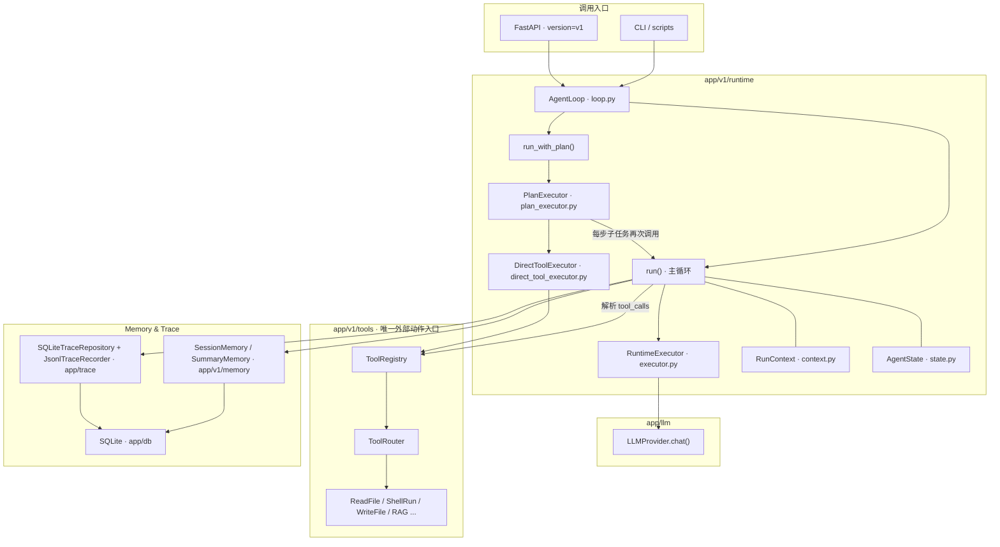

# Agent Runtime

本文档说明 `SimpleCodeAgent` 当前两条运行时主线：

- `v1`：单 Agent、工具驱动、稳定可演示
- `v2`：中心化多 Agent 编排（MVP）

目标是帮助你快速理解“谁负责调度、谁负责执行、如何收敛失败、如何追踪执行链路”。

---

## 1. 统一运行时约束（v1 / v2 共用）

- Agent 不直接执行外部动作；所有文件、Shell、检索行为都经由 Tool。
- Runtime 负责循环控制、状态管理、失败收敛和 trace 记录。
- 跨模块数据交换优先使用结构化 contract（Pydantic 模型）。
- 高风险行为必须可审计、可追踪，不依赖隐式副作用。

---

## 2. v1 Runtime（单 Agent）

`v1` 是当前教学主线，强调“可预测、可调试、可验证”。

### 2.1 架构图（组件与数据流）

下图概括 **v1 Agent Runtime** 的职责拆分：编排只在 `AgentLoop`；外部动作只经由 **Tool**；LLM 调用隔离在 **RuntimeExecutor**；观测与会话落在共享底座。

同一次 API / CLI 调用只会进入 **`run()`** 与 **`run_with_plan()`** 二者之一；上图把两条路径画在同一图中便于对照。

**读图要点**

| 模块 | 职责 |
|------|------|
| `AgentLoop` | `max_steps` / 超时、`RunResult` 组装、trace 事件、fallback 收敛 |
| `RuntimeExecutor` | 组装 `RunRequest`，调用 `LLMProvider`，捕获异常并返回同构 fallback |
| `PlanExecutor` | 复杂任务：顺序执行 `PlanStep`，可跳过 LLM 直接写文件、汇总失败语义 |
| `DirectToolExecutor` | 规划路径上的确定性工具执行与校验 |
| `ToolRegistry` / `ToolRouter` | 路由模型 tool call；异常转为 `ToolResult(is_error=true)`，不炸主循环 |
| `RunContext` / `AgentState` | 单次 run 的配置快照与可变对话/计数状态 |

### 2.2 主流程

1. 读取历史会话消息，组装本轮上下文。
2. 进入 step 循环（受 `max_steps` 和超时限制）。
3. 调用模型并解析响应：
   - 有 `tool_calls`：执行工具，回填工具结果，进入下一轮。
   - 有最终文本：结束并返回结果。
   - 空结果/异常：进入 fallback。
4. 持久化 session 消息、run 元数据和 trace。

### 2.3 失败收敛

- 超时：停止运行并返回失败结果。
- 达到最大步数：主动停止，避免死循环。
- 工具失败：以结构化 `ToolResult(is_error=true)` 回填给模型或上层处理。
- 模型异常：构造同构 fallback 结果，保证上层可消费。

### 2.4 关键实现位置

- 主循环：`app/v1/runtime/loop.py`
- 单步执行：`app/v1/runtime/executor.py`
- 规划执行：`app/v1/runtime/plan_executor.py`
- 工具注册与路由：`app/v1/tools/registry.py`、`app/v1/tools/router.py`

---

## 3. v2 Runtime（中心化多 Agent，MVP）

`v2` 采用中心化 orchestrator，不做去中心化自治调度。

### 3.1 角色分工

- `OrchestratorRuntime`：主流程调度与收敛控制
- `PlannerAgent`：生成/重生结构化计划
- `AnalystAgent`：项目分析与上下文摘要
- `CoderAgent`：局部编码修改（内部复用 v1 `AgentLoop` 作为执行单元）
- `TesterAgent`：命令执行与测试报告
- `ReviewerAgent`：可选审查环节（MVP 可开关）

### 3.2 主流程

1. 接收任务，初始化 `SharedWorkspace`。
2. 委派 `PlannerAgent` 生成结构化计划。
3. 按 step 委派目标 Agent 执行并更新 workspace/artifacts。
4. 根据结果做收敛控制：
   - tester 失败可回流 coder 修复
   - 连续失败触发 replan
   - 达上限 fail-fast/fallback
5. 汇总最终输出并落 trace/replay 数据。

### 3.3 边界

- 仅 orchestrator 持有委派能力（通过专用委派客户端）。
- 子 Agent 仅执行被委派任务，不再递归调度其他子 Agent。
- 当前仍是 MVP：主链路已打通，但并非完整生产级编排系统。

### 3.4 关键实现位置

- 主运行时：`app/v2/runtime.py`
- 上下文裁剪：`app/v2/context.py`
- Agent 注册：`app/v2/registry.py`、`app/v2/factory.py`
- 角色实现：`app/v2/agent_impls/*`
- Workspace 与回放：`app/v2/workspace.py`、`app/v2/repository.py`、`app/v2/replay.py`

---

## 4. Runtime 与可观测性

运行时至少应保证：

- 可识别 run/session 维度
- 可追踪关键事件（调用、委派、工具、失败、完成）
- 可重放主要执行过程（尤其是 v2 的 delegation 链路）

当前建议把 trace 当作“调试与教学的一等产物”，而不是附属日志。

---

## 5. 教学建议

- 先讲 `v1` 的单循环与工具回填，再引入 `v2` 的中心化委派。
- 对比说明：`v2` 的复杂度来自“角色协作编排”，不是“让每个 Agent 更智能”。
- 演示时优先展示可收敛场景：`plan -> code -> test -> (optional review)`。
